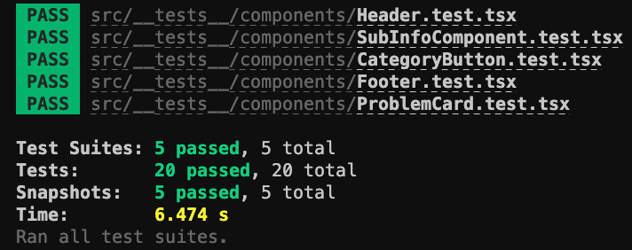
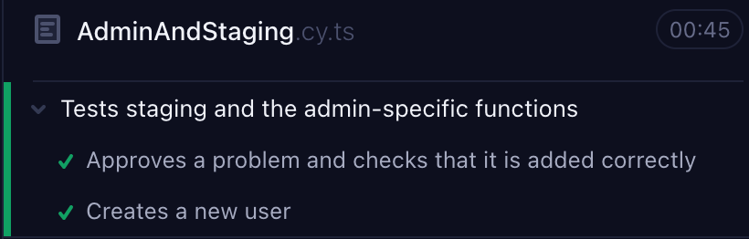
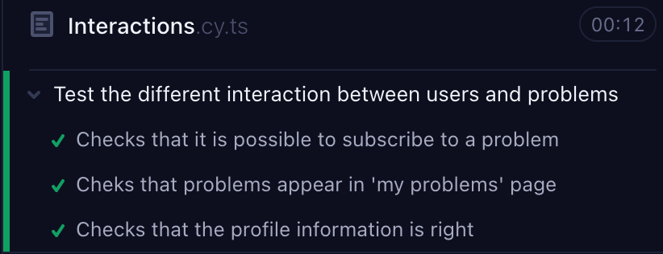
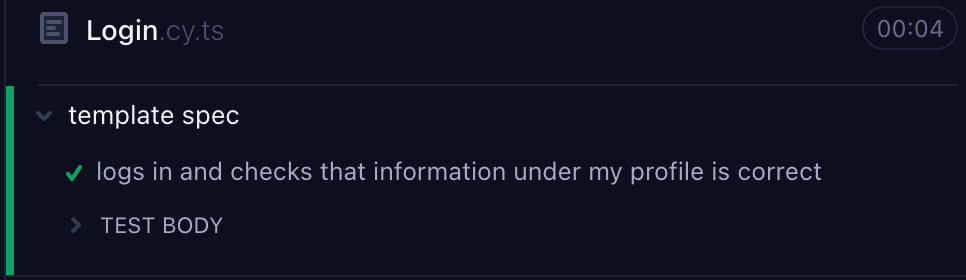
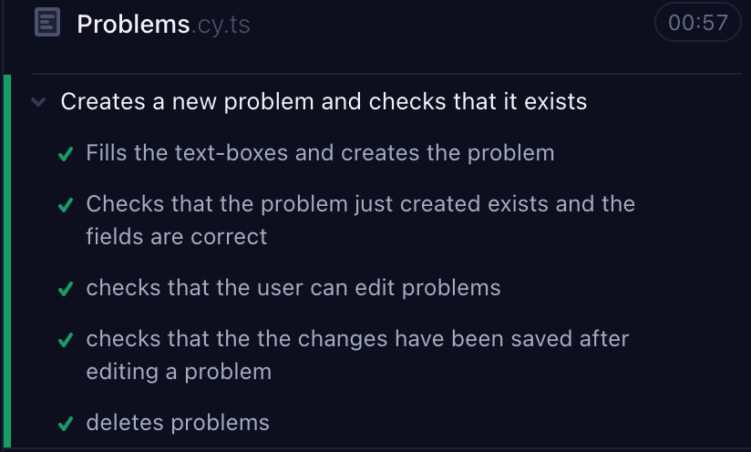

# Frontend

## Running Graph-Nesta

### `npm start`

Runs the app in development mode.\
Open [http://localhost:3000](http://localhost:3000) to view it in your browser.

The page will reload when you make changes.\
You may also see any Eslint errors in the console.

### `npm run build`

Builds the app for production to the `build` folder.\
It correctly bundles React in production mode and optimizes the build for the best performance.

The build is minified and the filenames include the hashes.\
Your app is ready to be deployed!

See the section about [deployment](https://facebook.github.io/create-react-app/docs/deployment) for more information.

### Mock Database
By running the commands in `Backend` above, a mock database is set up using docker. The mock database contains some data-related problems and some initial users.

|            Email            | Password |  Type |
|:---------------------------:|:--------:|:-----:|
| admin@trondheim.kommune.no  | admin    | admin |
| bruker@trondheim.kommune.no | bruker   | user  |
| bruker@malvik.kommune.no    | bruker   | user  |

### Known Bugs
- As an administrator. It is not possible to use "Business/third sector" as the value for the accessible data category field, due to no parsing before data is sent to the backend.

## Testing
A combination of manual and automated software testing was used to test the application. Initially, manual testing was performed, and later on, automated testing tools were employed to create and execute tests. Moreover, a validation test was conducted with test subjects being facilitated by Trondheim municipality to obtain feedback on the overall application's usability.

### Unit & Snapshot Testing
```
cd graph-nesta/frontend
npm test
a (to run all tests)
```



### End-To-End Testing
Terminal 1
```
cd graph-nesta/backend
npm run
```
Terminal 2
```
cd graph-nesta/frontend
npm run
```

Terminal 3
```
npm run cypress:open
```
- Wait for the Cypress application to open.
- Choose E2E-testing and then browser.
- Choose the test file to run.

\
\
\
\


